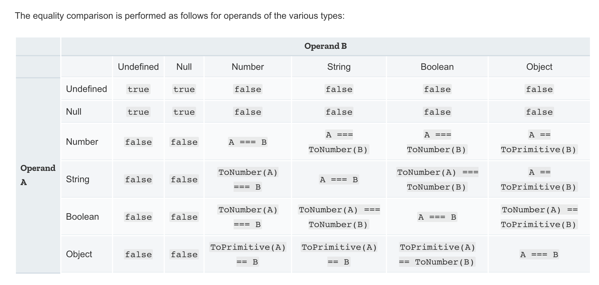
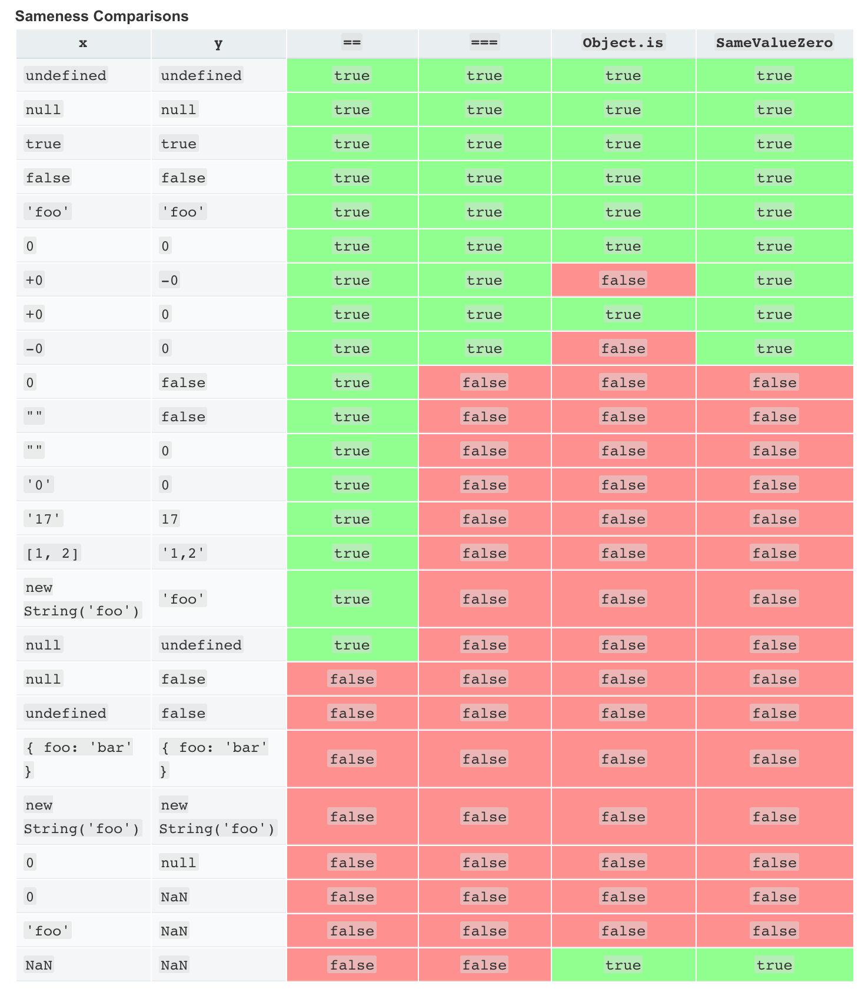
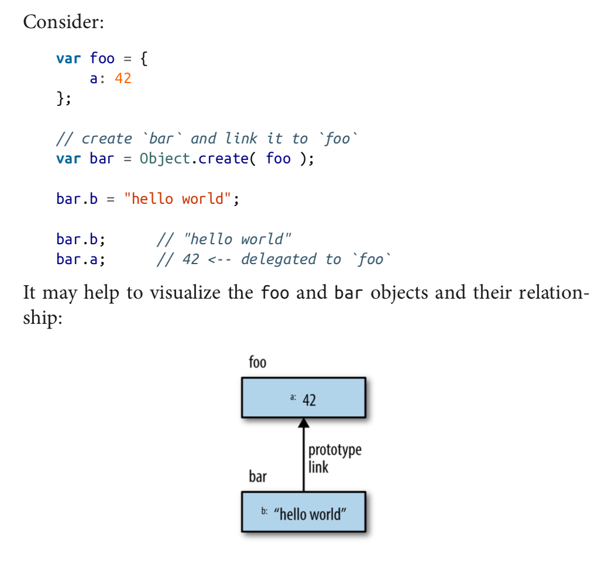

# - Getting started with javascript [You-Dont-Know-JS]

I- Intro to programming :

        > age = prompt( "Please tell me your age:" );
        > console.log( age );

- Equality :

            == (loose-equals),
            === (strict-equals),
            != (loose not-equals),
            !== (strict not-equals), as in a == b.

1- Strict equality using ===

    Strict equality compares two values for equality. Neither value is implicitly converted to some other value before being compared.

    1-1 If the values have different types, the values are considered unequal.

        Example:
            var num = 0;
            var str_num = new String('0');
            console.log(num === str_num) # false

    1-2 If the values have the same type, are not numbers, and have the same value, they're considered equal.

        Example:
            var num_str_1 = '0';
            var num_str_2 = '0';
            console.log(num_str_1 === num_str_2); # true

    1-3 Finally, if both values are numbers, they're considered equal if they're both not NaN and are the same value, or if one is +0 and one is -0.

        Example:
            var num_1 = 0;
            var num_2 = 0;
            console.log(num_1 === num_2); # true

2- Loose equality using == :

            - the loose equality '==' apply a type conversion before comparing as it's expained in the table above.

            var num = 0;
            var obj = new String('0');
            var str = '0';

            console.log(num == num); // true
            console.log(obj == obj); // true
            console.log(str == str); // true

            console.log(num == obj); // true
            console.log(num == str); // true
            console.log(obj == str); // true
            console.log(null == undefined); // true

            // both false, except in rare cases
            console.log(obj == null);
            console.log(obj == undefined);

- Scope :

    If you ask the phone store employee for a phone model that her store doesn’t carry, she will not be able to sell you the phone you want.
    She only has access to the phones in her store’s inventory. You’ll have to try another store to see if you can find the phone you’re looking for.
    Programming has a term for this concept: scope (technically called lexical scope). In JavaScript, each function gets its own scope.
    Scope is basically a collection of variables as well as the rules for how those variables are accessed by name.
    Only code inside that function can access that function’s scoped variables.

    -> scope is the local variables and other resources that are accessable just though a function :

    Example :

        function one() {
            // this `a` only belongs to the `one()` function vara=1;
            console.log( a );
        }

        function two() {
            // this `a` only belongs to the `two()` function vara=2;
            console.log( a );
        }

        one(); // 1
        two(); // 2

    =+ Nested scopes :

        function outer() {
                var a=1;

                function inner() {
                    var b=2;
                    // we can access both `a` and `b` here
                    console.log( a + b ); // 3
                }

        inner();
        // we can only access `a` here
        console.log( a ); // 1

        }

        outer();

    -> code inside the innermost scope can access variables from either scope.

    #So, code inside the inner() function has access to both variables a and b, but code only in outer()
     has access only to a—it cannot access b because that variable is only inside inner().

            Recall this code snippet from earlier:
                const TAX_RATE = 0.08;
                function calculateFinalPurchaseAmount(amt) {
                        // calculate the new amount with the tax
                        amt = amt + (amt * TAX_RATE);
                        // return the new amount
                return amt;
                }

    The TAX_RATE constant (variable) is accessible from inside the calcu lateFinalPurchaseAmount(..) function,
    even though we didn’t pass it in, because of lexical scope.

II- Into JavaScript :

+ Values & Types :

            --+ JavaScript has typed values, not typed variables. The following built-in types are available:

            • string
            • number
            • boolean
            • null and undefined • object
            • symbol (new to ES6)

            JavaScript provides a typeof operator that can examine a value and
            tell you what type it is:

            var a;
            typeof a; // "undefined"

            a = "hello world";
            typeof a; // "string"

            a=42;
            typeof a; // "number"

            a = true;
            typeof a; // "boolean"

            a = null;
            typeof a; // "object"--weird, bug

            a = undefined;
            typeof a; // "undefined"

            a={b:"c"};
            typeof a; // "object"

            Notice: how in this snippet the a variable holds every different type of value, and that despite appearances,
                    typeof a is not asking for the “type of a,” but rather for the “type of the value currently in a.”
                    Only values have types in JavaScript; variables are just simple con‐ tainers for those values.

    - Objects

            The object type refers to a compound value where you can set properties (named locations) that each hold their own values of any type.
            This is perhaps one of the most useful value types in all of Java‐ Script:

            varobj={
                a: "hello world",
                b: 42,
                c: true
            };

            obj.a; // "hello world"
            obj.b; // 42
            obj.c; // true

            obj["a"]; // "hello world"
            obj["b"]; // 42
            obj["c"]; // true

            - Keys of objects :

            var obj={
                a: "hello world",
                b: 42
            };

            var b="a";

            obj[b]; // "hello world"
            obj["b"]; // 42

    + Arrays

            An array is an object that holds values (of any type) not particularly in named properties/keys, but rather in numerically indexed posi‐ tions. For                 example:
            vararr=[
                "hello world",
                42,
                true
            ];

            arr[0]; // "hello world"
            arr[1]; // 42
            arr[2]; // true
            arr.length; // 3

            typeof arr; // "object"

            + Arrays vs Objects (usage) :

            The best and most natural approach is to use arrays for numerically positioned values and use objects for named properties.

    + Functions

            The other object subtype you’ll use all over your JS programs is a function:

            function foo() {
                return 42;
            }

            foo.bar = "hello world";
            typeof foo; // "function"
            typeof foo(); // "number"
            typeof foo.bar; // "string"

    + Built-In Type Methods :

            For example:
            var a = "hello world";
            var b = 3.14159;
            a.length; // 11
            a.toUpperCase(); // "HELLO WORLD"
            b.toFixed(4); // "3.1416"

    - Coercion or type conversion :

            Here’s an example of explicit coercion:
            var a = "42";
            var b=Number(a);
            a; // "42"
            b; // 42--the number!
            And here’s an example of implicit coercion:
            var a = "42";
            var b = a * 1; // "42" implicitly coerced to 42 here
            a; // "42"
            b; // 42--the number!

    - Strict Mode :

            You can use strict mode in all your programs. It helps you to write cleaner code, like preventing you from using undeclared variables.

            - Examples :

                "use strict";
                x = 3.14;       // This will cause an error because x is not declared

                ------------------------------------------------------------------------------

                "use strict";
                myFunction();

                function myFunction() {
                  y = 3.14;   // This will also cause an error because y is not declared
                }

                ------------------------------------------------------------------------------

                x = 3.14;       // This will not cause an error.
                myFunction();

                function myFunction() {
                  "use strict";
                  y = 3.14;   // This will cause an error
                }

    + Functions as Values :

            This may sound like a strange concept at first, so take a moment to ponder it.
            Not only can you pass a value (argument) to a function, but a function itself
            can be a value that’s assigned to variables or passed to or returned from other functions.

            Consider:

            var foo = function() {
                // ..
            };

            var x = function bar(){
                // ..
            };

            1- The first function expression assigned to the foo variable is called anonymous because it has no name.
            2- The second function expression is named (bar), even as a reference to it is also assigned to the x variable.
               Named function expressions are generally more preferable, though anonymous function expressions are still extremely common.

            There’s another way to execute a function expression, which is typi‐ cally referred to as an immediately invoked function expression (IIFE):

            > (function IIFE(){ console.log( "Hello!" );})();

    + Closure :

        -> You can think of closure as a way to “remember” and continue to access a function’s scope (its variables) even once the function has finished running.

    Consider:

            function makeAdder(x) {
            // parameter `x` is an inner variable
            // inner function `add()` uses `x`, so
            // it has a "closure" over it

            function add(y) {
                    return y + x;
                };
                return add;
            }

            The reference to the inner add(..) function that gets returned with each call to the outer makeAdder(..) is able to remember whatever x value was passed in to makeAdder(..). Now, let’s use makeAd der(..):

            // `plusOne` gets a reference to the inner `add(..)`
            // function with closure over the `x` parameter of
            // the outer `makeAdder(..)`
            var plusOne = makeAdder( 1 );

            plusOne( 3 ); // 4 <- 3+1
            plusOne( 41 ); // 42 <- 41+1

            More on how this code works:
            1. When we call makeAdder(1), we get back a reference to its inner add(..) that remembers x as 1. We call this function reference plusOne(..).
            2. When we call plusOne(3), it adds 3 (its inner y) to the 1 (remembered by x), and we get 4 as the result.

    + Modules

            The most common usage of closure in JavaScript is the module pat‐ tern. Modules let you define private implementation details (vari‐ ables, functions)             that are hidden from the outside world,
            as well as a public API that is accessible from the outside.

            Consider:

            function User(){
            var username, password;
                function doLogin(user,pw) {
                    username = user;
                    password = pw;
                    // do the rest of the login work
                }

                var publicAPI = {
                    login: doLogin
                };
            return publicAPI;

            }
            // create a `User` module instance
            var fred = User();

            fred.login( "fred", "12Battery34!" );

    + 'this' Identifier :

            It’s important to realize that this does not refer to the function itself, as is the most common misconception.
            Here’s a quick illustration:

            function foo() {
                'use strict'
                console.log( this.bar );
            }

            var bar = "global";

            var obj1={
                        bar: "obj1",
                        foo: foo
                      };

            var obj2={ bar: "obj2" };

            // --------
            foo(); // "global"

            obj1.foo(); // "obj1"
            foo.call( obj2 ); // "obj2"
            new foo(); // undefined

    -> 'this' refer to the property that called it. if no one then it will print 'undefined'.

             function foo() {
                'use strict'
                console.log( this.bar );
            }

            foo() -> with strict mode you will get an error "ncaught TypeError: Cannot read property 'bar' of undefined".

            There are four rules for how this gets set, and they’re shown in those last four lines of that snippet:
            1. foo() ends up setting this to the global object in non-strict mode—in strict mode, this would be undefined
               and you’d get an error in accessing the bar property—so "global" is the value found for this.bar.
            2. obj1.foo() sets this to the obj1 object.
            3. foo.call(obj2) sets this to the obj2 object.
            4. new foo() sets this to a brand new empty object.

            Bottom line: to understand what this points to, you have to exam‐ ine how the function in question was called.
            It will be one of those four ways just shown, and that will then answer what this is.

    + Prototypes :

            When you reference a property on an object, if that property doesn’t exist, JavaScript will automatically
            use that object’s internal proto‐ type reference to find another object to look for the property on.
            You could think of this almost as a fallback if the property is miss‐ ing.

            The a property doesn’t actually exist on the bar object, but because bar is prototype-linked to foo, JavaScript
            automatically falls back to looking for a on the foo object, where it’s found.

# - Scopes & Closures [You-Dont-Know-JS]

    - Compiler Theory :

    In traditional compiled-language process, a chunk of source code, your program, will undergo typically three steps before it is executed, roughly called “compilation”:

    Tokenizing/Lexing
    Breaking up a string of characters into meaningful (to the lan‐ guage) chunks, called tokens. For instance, consider the program var a = 2;. This program would likely be broken up into the following tokens: var, a, =, 2, and ;.
    Whitespace may or may not be persisted as a token, depending on whether its meaningful or not.
    The difference between tokenizing and lexing is subtle and academic, but it centers on whether or not these tokens are identified in a stateless or stateful way. Put simply, if the tokenizer were to invoke stateful parsing rules to fig‐ ure out
    whether a should be considered a distinct token or just part of another token, that would be lexing.

    Parsing
    taking a stream (array) of tokens and turning it into a tree of nested elements, which collectively represent the grammatical structure of the program. This tree is called an “AST” (abstract syntax tree).
    The tree for var a = 2; might start with a top-level node called VariableDeclaration, with a child node called Identifier (whose value is a), and another child called AssignmentExpres sion, which itself has a child called NumericLiteral (whose value is 2).

    Code-Generation
    The process of taking an AST and turning it into executable code. This part varies greatly depending on the language, the platform it’s targeting, and so on.
    So, rather than get mired in details, we’ll just handwave and say that there’s a way to take our previously described AST for var a = 2; and turn it into a set of machine instructions to actually create
    a variable called a (including reserving memory, etc.), and then store a value into a.

